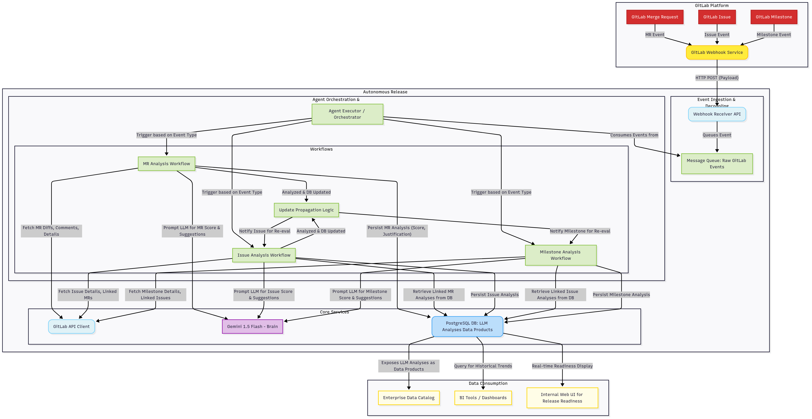
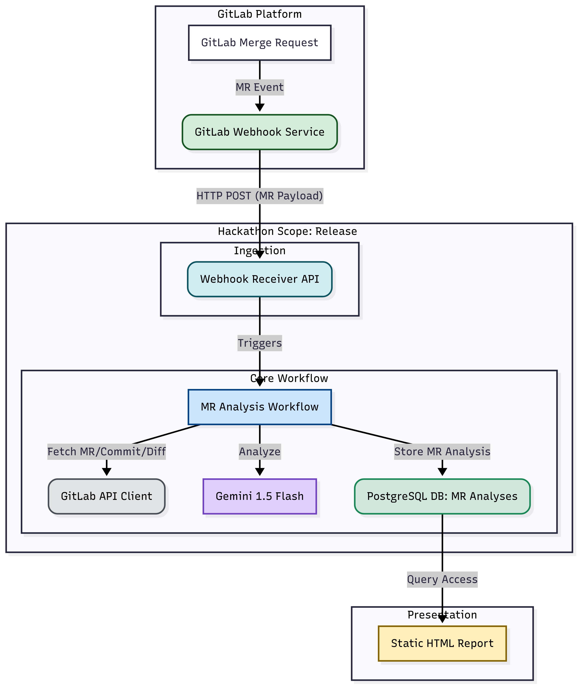

# Autonomous GitLab Release Readiness Agent

## 1. Introduction & Problem Statement

In modern software development, understanding the true "readiness" of a release is critical for all stakeholders, from developers and QA to business analysts and executives. Traditional methods often rely on manual checks, fragmented information, and subjective assessments, leading to:

* **Delayed Feedback:** Issues are caught late in the cycle.
* **Lack of Real-time Insight:** Current status is often outdated or incomplete.
* **Inconsistent Assessments:** Different teams or individuals may interpret readiness differently.
* **Limited Auditability:** Difficulty in tracking historical readiness trends and justifications.
* **Overwhelm for Reviewers:** Manual review of numerous MRs, issues, and their associated changes becomes a bottleneck.

Our goal is to build an autonomous agent that addresses these challenges by providing continuous, data-driven, and intelligent assessments of release readiness.

## 2. Core Concept & Value Proposition

The **Autonomous GitLab Release Readiness Agent** will be an intelligent system that:

* **Continuously Monitors:** Integrates directly with GitLab via webhooks to react to changes in real-time.
* **Leverages AI:** Utilizes an advanced Large Language Model to understand context, analyze development artifacts (MRs, issues), and provide insightful feedback.
* **Generates Hierarchical Scores:** Calculates objective "Confidence Scores" at the Merge Request, Issue, and Milestone levels.
* **Provides Actionable Suggestions:** Offers concrete recommendations for improving code quality, documentation, and overall readiness.
* **Maintains Memory & Auditability:** Persists all LLM-generated analyses in a PostgreSQL database, serving as a valuable historical record and a "data product" for broader organizational use.
* **Enhances Collaboration & Transparency:** Provides a unified, real-time view of release health for developers, business analysts, and executives.

## 3. Target Audience

This agent is designed to empower:

* **Developers:** Receive immediate, objective feedback on MRs to improve code quality and align with release goals.
* **Business Analysts:** Gain clear visibility into feature progress and potential blockers.
* **Stakeholders & Executives:** Access high-level, data-driven confidence scores for strategic decision-making and cross-team comparison.

## 4. Key Challenges Addressed

Our agent directly tackles the limitations of traditional approaches:

* **Problem: No Real-time Trigger for Updates**
    * **Solution:** Implement **GitLab Webhooks** for Merge Request, Issue, and Milestone events, ensuring the agent is always aware of the latest changes.
* **Problem: Lack of Memory & Context; Large Prompt Sizes**
    * **Solution:** A **PostgreSQL Database** will store only the LLM-generated analyses (scores, justifications, actionable improvements). Raw GitLab data (diffs, comments, etc.) will be fetched dynamically via the GitLab API when needed, keeping LLM prompts concise and efficient. The agent's "memory" will be derived from these persisted historical analyses.
* **Problem: Hasty Commit-Level Scores; Monolithic Logic**
    * **Solution:** Establish **distinct, interconnected workflows (tools)** for Merge Request, Issue, and Milestone analysis. LLM will assess at the *Merge Request* level (based on the entire MR's changes), and then scores will aggregate hierarchically. A dedicated **Update Propagation Workflow** ensures scores are cascaded up the hierarchy automatically (MR -> Issue -> Milestone).
* **Problem: Need for Auditability & Enterprise Data Mesh Alignment**
    * **Solution:** The PostgreSQL database will serve as the persistent layer for LLM-generated insights. These insights will be treated as **"Data Products"** within a conceptual **Enterprise Data Mesh (JANUS)** framework, making them discoverable via a data catalog and consumable by other systems like BI Tools/Dashboards for executive reporting.

## 5. Enterprise-Level Architecture (Full Scope)

The comprehensive vision involves a robust, event-driven architecture designed for scalability and reliability.

### Key Components:

* **GitLab Platform:** Source of all development events (Merge Requests, Issues, Milestones).
* **GitLab Webhook Service:** GitLab's mechanism for sending event payloads.
* **Webhook Receiver API:** A lightweight Python web server (e.g., Flask/FastAPI) that securely receives and validates incoming GitLab webhooks.
* **Message Queue (e.g., RabbitMQ/Kafka):** Decouples webhook reception from processing, ensuring event reliability and asynchronous execution.
* **Agent Executor / Orchestrator:** The "brain" of the autonomous agent, written in Python. It consumes events from the message queue and intelligently dispatches them to the appropriate workflow.
* **Workflows (LLM Tools):**
    * **MR Analysis Workflow:** Analyzes Merge Requests (title, description, all commits & diffs, comments, reviews) using Gemini 1.5 Flash to generate a **Merge Request Readiness Score** and actionable improvements.
    * **Issue Analysis Workflow:** Analyzes Issues (description, comments) and aggregates the **Merge Request Readiness Scores** of all linked MRs to generate an **Issue Readiness Score**.
    * **Milestone Analysis Workflow:** Analyzes Milestones and aggregates the **Issue Readiness Scores** of all contained issues to generate an **Overall Milestone Release Confidence Score**.
    * **Update Propagation Logic:** Ensures that when a lower-level entity's score changes (e.g., an MR), the linked higher-level entities (Issue, Milestone) are re-evaluated.
* **GitLab API Client:** A Python library (`python-gitlab`) used by workflows to fetch real-time GitLab data (diffs, comments, issue/MR details) on demand.
* **Gemini 1.5 Flash:** The core Large Language Model used by the workflows for intelligent analysis, score generation, and suggestion formulation. Chosen for its speed and capability balance.
* **PostgreSQL Database:** The persistent memory of the agent. It stores *only* the LLM-generated analyses (scores, justifications, actionable improvements) for MRs, Issues, and Milestones. This data serves as the foundation for auditability and as "Data Products."

### Data Flow & Propagation:

1.  A change occurs in GitLab (e.g., new commit in an MR, new comment on an issue, issue linked to a milestone).
2.  GitLab sends a webhook event to the **Webhook Receiver API**.
3.  The receiver validates the webhook and pushes the event payload to the **Message Queue**.
4.  The **Agent Executor / Orchestrator** consumes the event from the queue.
5.  Based on the event type, the Orchestrator triggers the relevant **Analysis Workflow** (MR, Issue, or Milestone).
6.  The workflow uses the **GitLab API Client** to fetch necessary live data and sends targeted prompts to **Gemini 1.5 Flash** for analysis.
7.  The LLM's analysis (score, justification, suggestions) is stored in the **PostgreSQL Database**.
8.  The **Update Propagation Logic** ensures that if a lower-level entity's analysis was updated (e.g., an MR score), the associated higher-level entities are queued for re-evaluation.

## 6. Hackathon Scope (4-5 Days Presentable POC)

To demonstrate core capabilities and secure further investment, we will focus on a subset of the full vision for a hackathon:

### Hackathon Components & Flow:

1.  **GitLab Merge Request Event:** The primary trigger.
2.  **Webhook Receiver API:** A basic Flask/FastAPI application set up to receive only `merge_request` events from GitLab.
3.  **MR Analysis Workflow:**
    * When an MR event is received, this workflow is triggered.
    * It calls the **GitLab API Client** to fetch details for the specific MR, including all its commits and file diffs.
    * It sends a concise, targeted prompt to **Gemini 1.5 Flash** to analyze the MR's readiness.
    * The LLM's output (MR Readiness Score, justification, actionable improvements) is then stored in the **PostgreSQL Database**.
4.  **PostgreSQL Database:** Will contain a table specifically for MR analysis results.
5.  **Static HTML Report:** A simple HTML/CSS/JavaScript page (building on our previous POC) that queries the PostgreSQL database to display the latest MR readiness scores and their details in a user-friendly format. This will be the primary output for the hackathon demonstration.

### Achievables in 4-5 Days:

* Functional GitLab webhook integration.
* Basic Flask/FastAPI application to receive webhooks.
* PostgreSQL database setup and schema for MR analyses.
* Python functions to interact with GitLab API (`python-gitlab`).
* Python functions to interact with Gemini 1.5 Flash API.
* Core logic for MR analysis: fetching data, prompting LLM, parsing response, saving to DB.
* A static HTML page that dynamically loads and displays MR analysis data from the PostgreSQL database.

## 7. Technologies Involved

* **Backend & Agent Logic:** Python
* **Web Framework (for Webhook Receiver):** Flask or FastAPI
* **Database:** PostgreSQL
* **GitLab Interaction:** `python-gitlab` library
* **LLM Integration:** Google Gemini 1.5 Flash API
* **Message Queue (Enterprise):** Kafka or RabbitMQ (conceptual for hackathon, direct call for simplicity)
* **Frontend (Hackathon):** HTML, CSS, JavaScript (vanilla or simple library)

---